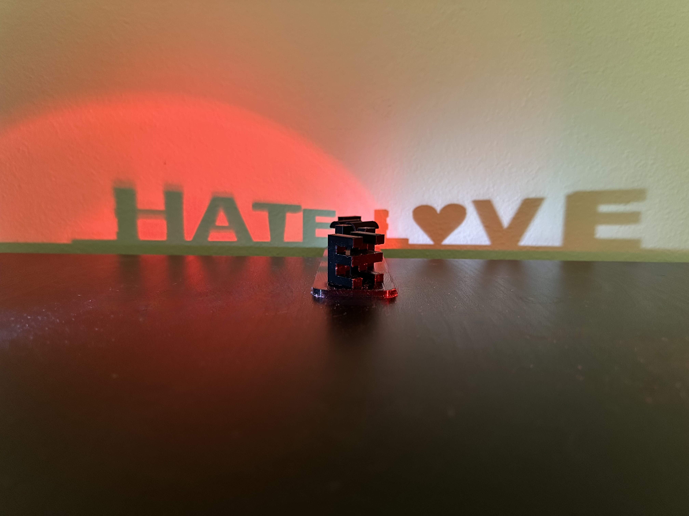
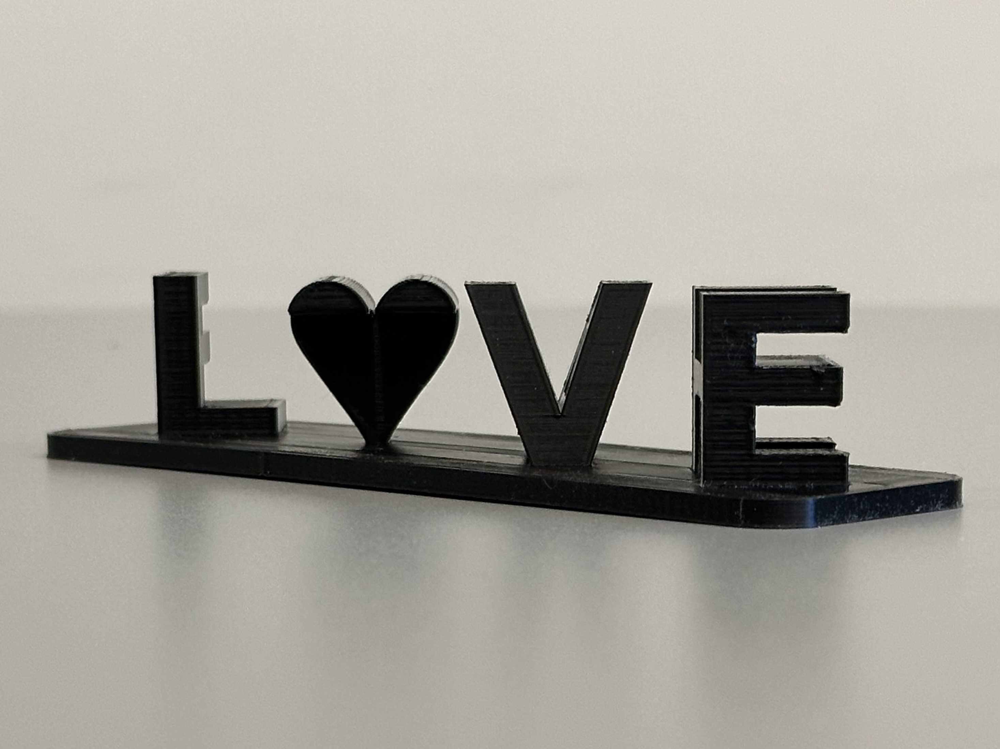
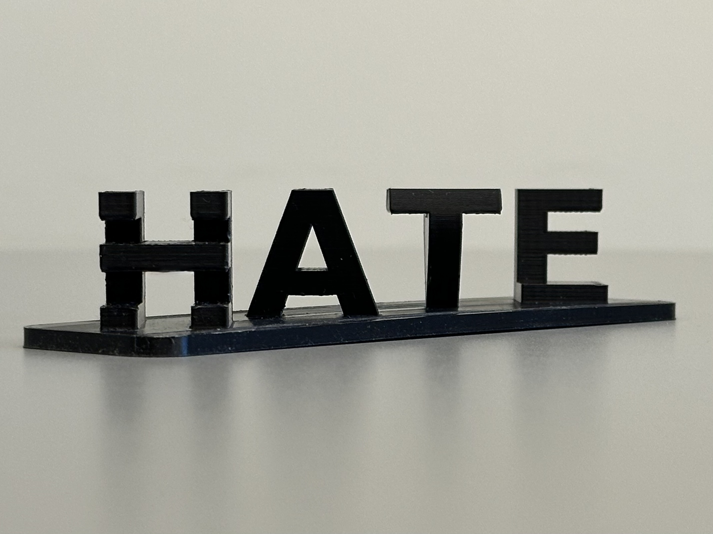
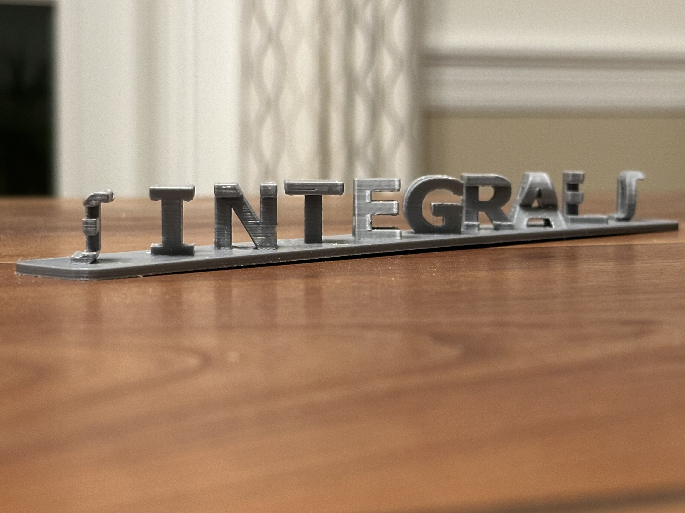
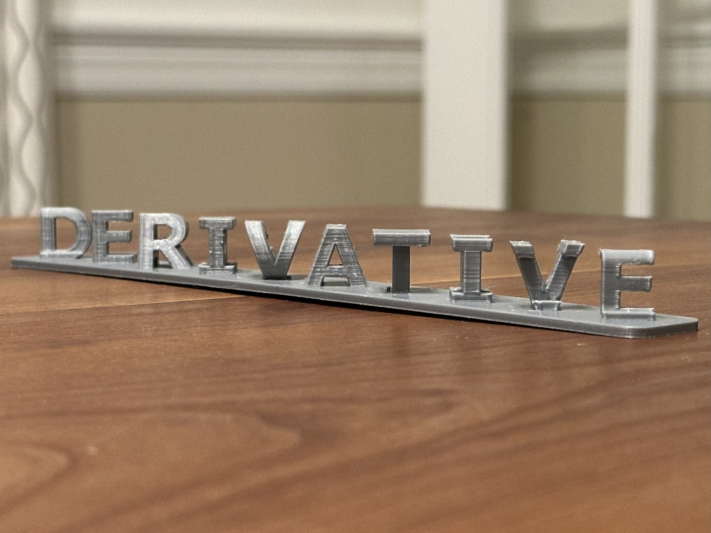
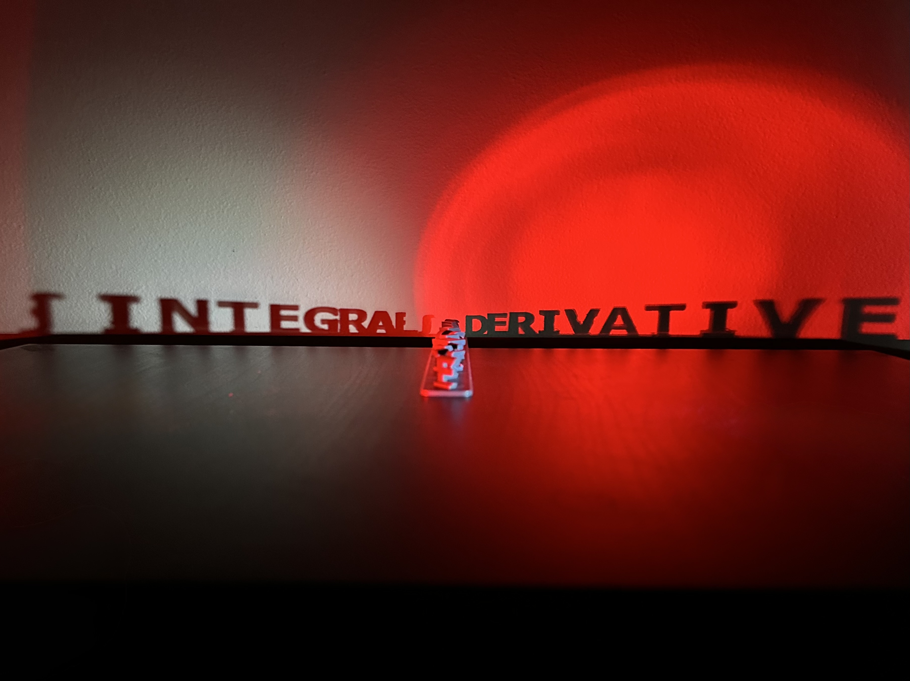
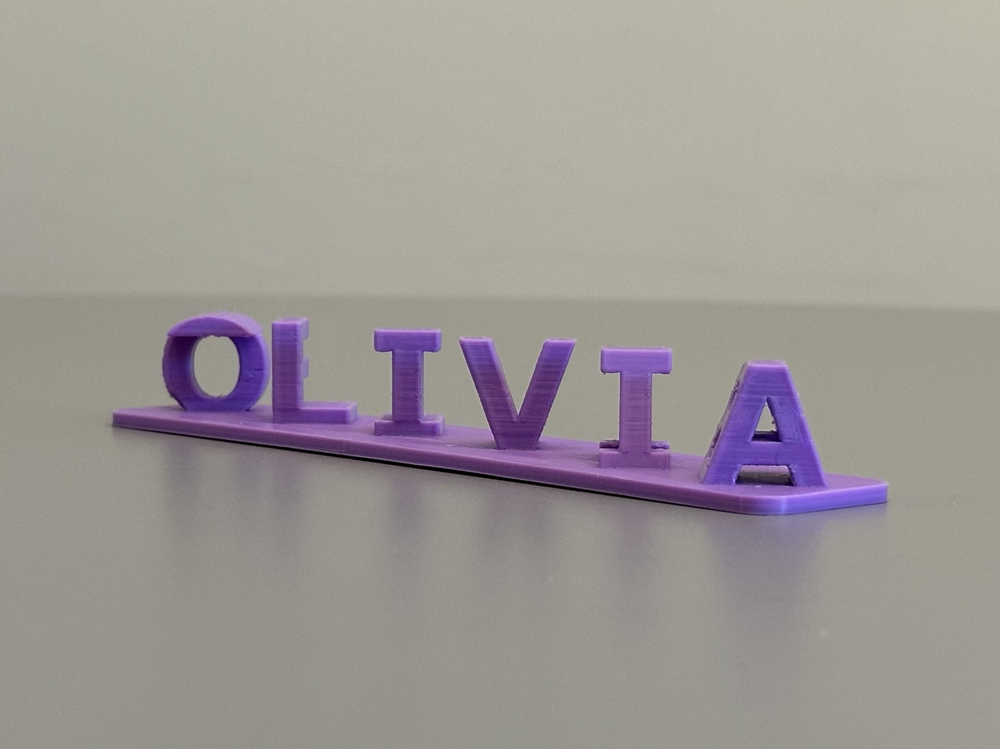
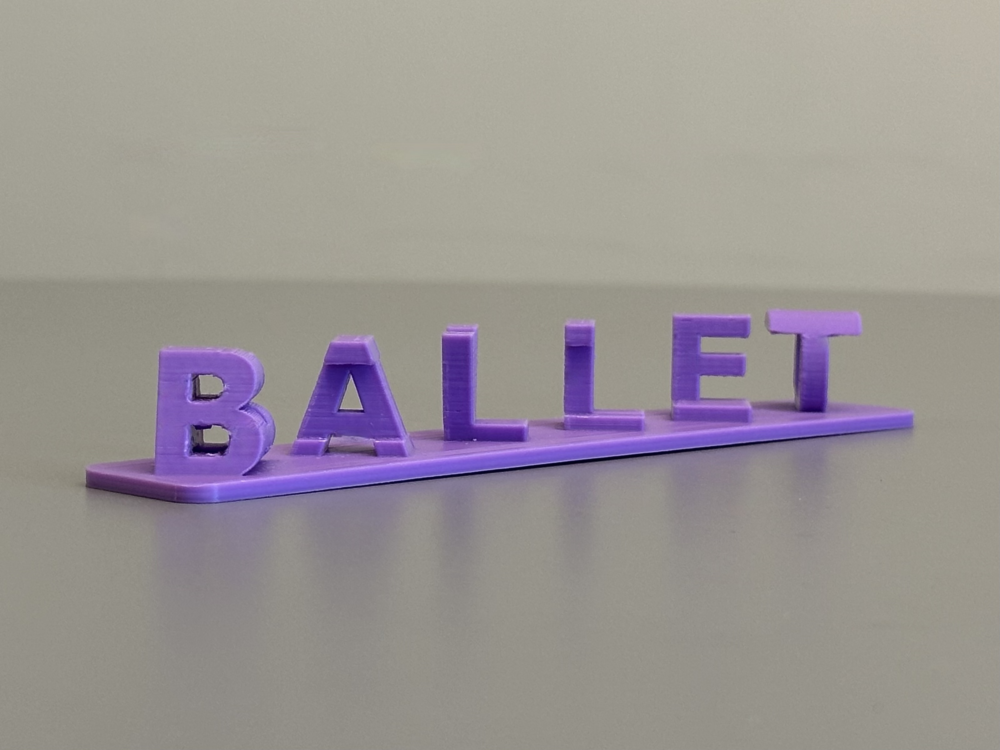

[](https://github.com/YOUR_USERNAME/YOUR_REPO)
[](https://github.com/YOUR_USERNAME/YOUR_REPO/releases)

# Two-Perspective Words

This repository contains an OpenSCAD model for generating **two-view word sculptures**—3D designs that spell one word when viewed from the left and a different word when viewed from the right. 

## Table of Contents

- [Description](#description)
- [Features](#features)
- [Examples](#examples)
- [STL Downloads](#stl-downloads)
- [How to Use](#how-to-use)
- [Printing Tips](#printing-tips)
- [Included Files](#included-files)
- [License](#license)

## Description

- The model takes two words (of equal length) and creates a 3D object.
- The words are visible from **45° angles** on each side.
- A **rounded baseplate** supports the design for 3D printing stability.
- Symbols like **♥** and **∫** are supported with custom font switching, scaling, and vertical shifting.

## Features

- Fully customizable: font, height, spacing, scaling
- Optional special character support (e.g., heart ♥, integral ∫) with adjustable font, size, and shift
- STL export-ready
- Perfect for 3D printing

## Examples

### L♥VE / HATE

<p align="center">
  
  
</p>
<p align="center">
  
  
</p>


### DERIVATIVE / INTEGRAL

<p align="center">
  
  
</p>
<p align="center">
  
</p>


### OLIVIA / BALLET

<p align="center">
  
  
</p>

## STL Downloads

- [`LoveHate.stl`](LoveHate.stl) — L♥VE/HATE example
- [`DerivativeIntegral.stl`](DerivativeIntegral.stl) — DERIVATIVE/INTEGRAL example

## How to Use

1. Open `TwoPerspectiveWords.scad` in [OpenSCAD](https://openscad.org/).
2. Set your desired word pair:

   ```openscad
   string_1 = "L♥VE";     // Viewed from the left
   string_2 = "HATE";     // Viewed from the right
   ```

   **Important:**  
   - Words must have the same number of characters.
   - Use **all capital letters** (or at least characters with full height) for consistent visual appearance.

3. Customize:
   - Font, letter size, spacing
   - Enable and configure a **special character** (e.g., heart ♥, integral ∫), adjusting:
     - `special_char` (character)
     - `special_font` (font for that character)
     - `special_scale` (relative size adjustment)
     - `special_vertical_shift` (vertical shift adjustment)

4. Optional:
   - Set `include_baseplate = false;` to remove the supporting base.

5. Render and export to `.stl` for 3D printing.

## Printing Tips

When printing this model on a standard desktop FDM (extrusion-based) printer, keep the following in mind:

- **Supports are required** to successfully print the letters, which often have significant overhangs.
- Removing supports can be challenging. The letters and the attachment points of the letters to the base are relatively small and delicate, so it is important to remove supports carefully to avoid damaging them.
- To ensure durability, especially where letters intersect and connect to the baseplate, it is recommended to use a **high infill setting (e.g., 50%)**. This increases the strength of thin or intersecting parts and improves the overall robustness of the model.

## Included Files

- `TwoPerspectiveWords.scad` — Parametric OpenSCAD model
- `LoveHate.stl` — L♥VE/HATE STL output
- `DerivativeIntegral.stl` — DERIVATIVE/INTEGRAL STL output

## License

This project is licensed under the [Creative Commons Attribution-NonCommercial 4.0 International License](https://creativecommons.org/licenses/by-nc/4.0/).  
You may use, remix, and print for personal or educational purposes, but **not for commercial sale**.
